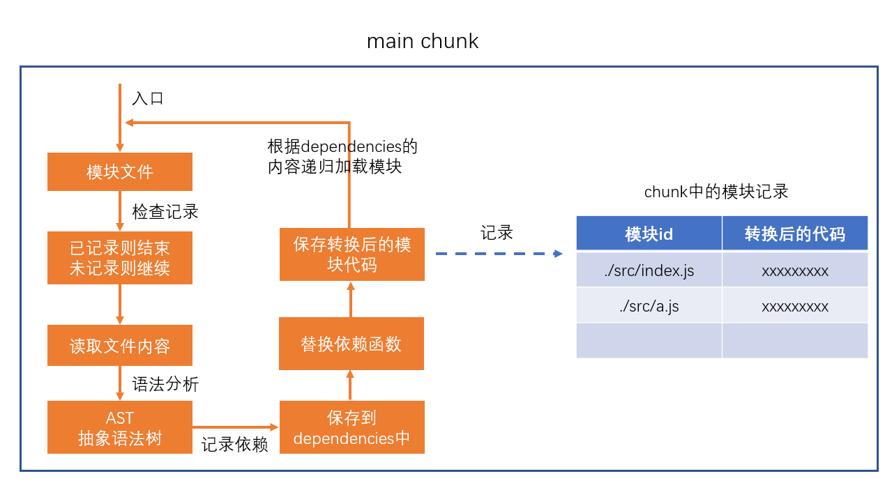

# webpack

## 在浏览器端实现模块化 


### 浏览器端的模块化

问题：

- 效率问题：精细的模块划分带来了更多的JS文件，更多的JS文件带来了更多的请求，降低了页面访问效率
- 兼容性问题：浏览器目前仅支持ES6的模块化标准，并且还存在兼容性问题
- 工具问题：浏览器不支持npm下载的第三方包

这些仅仅是前端工程化的一个缩影，还会遇到许多非业务问题，非常影响开发进度，所以急需一个好的工具来解决这些问题。


### 根本原因

思考：上面提到的问题，为什么在node端没有那么明显，反而到了浏览器端变得如此严重呢？

答：在node端，运行的JS文件在本地，因此可以本地读取文件，它的效率比浏览器远程传输文件高的多

**根本原因**：在浏览器端，开发时态（devtime）和运行时态（runtime）的侧重点不一样

**开发时态，devtime：**

1. 模块划分越细越好
2. 支持多种模块化标准
3. 支持npm或其他包管理器下载的模块
4. 怎么舒服怎么来，不用考虑什么兼容性问题，等等。

**运行时态，runtime：**

1. 文件越少越好
2. 文件体积越小越好
3. 代码内容越乱越好
4. 所有浏览器都要兼容
5. 能够解决其他运行时的问题，主要是执行效率问题 ？？？？ 后面讲

这种差异在小项目中表现的并不明显，可是一旦项目形成规模，就越来越明显，如果不解决这些问题，前端项目很难形成规模

### 解决办法

既然开发时态和运行时态面临的局面有巨大的差异，因此，我们需要有一个工具，这个工具能够让开发者专心的在开发时态写代码，然后利用这个工具将开发时态编写的代码转换为运行时态需要的东西。

这样的工具，叫做**构建工具**


这样一来，开发就可以专注于开发时态的代码结构，而不用担心运行时态遇到的问题了。

### 常见的构建工具

- **webpack**
- grunt
- gulp
- rollup
- vite
- browserify
- fis
- 其他

## webpack的安装和使用 


> webpack官网：https://www.webpackjs.com/


### webpack简介

webpack是基于模块化的打包（构建）工具，它把一切视为模块

它通过一个开发时态的入口模块为起点，分析出所有的依赖关系，然后经过一系列的过程（压缩、合并），最终生成运行时态的文件。

webpack的特点：

- **为前端工程化而生**：webpack致力于解决前端工程化，特别是浏览器端工程化中遇到的问题，让开发者集中注意力编写业务代码，而把工程化过程中的问题全部交给webpack来处理
- **简单易用**：支持零配置，可以不用写任何一行额外的代码就使用webpack
- **强大的生态**：webpack是非常灵活、可以扩展的，webpack本身的功能并不多，但它提供了一些可以扩展其功能的机制，使得一些第三方库可以融于到webpack中
- **基于nodejs**：由于webpack在构建的过程中需要读取文件，因此它是运行在node环境中的
- **基于模块化**：webpack在构建过程中要分析依赖关系，方式是通过模块化导入语句进行分析的，它支持各种模块化标准，包括但不限于CommonJS、ES6 Module

### webpack的安装

webpack通过npm安装，它提供了两个包：

- webpack：核心包，包含了webpack构建过程中要用到的所有api
- webpack-cli：提供一个简单的cli命令，它调用了webpack核心包的api，来完成构建过程

安装方式：

- 全局安装：可以全局使用webpack命令，但是无法为不同项目对应不同的webpack版本
- **本地安装**：推荐，每个项目都使用自己的webpack版本进行构建

### 使用

```shell
webpack
```

默认情况下，webpack会以```./src/index.js```作为入口文件分析依赖关系，打包到```./dist/main.js```文件中

通过--mode选项可以控制webpack的打包结果的运行环境

```js
// 可以在package.json文件的脚本scripts中配置

  "scripts": {
    "build": "webpack --mode=production --watch", // --watch它会监听文件的变化，自动构建打包
    "dev": "webpack --mode=development --watch"
  }
```


##  编译结果分析

```js
//合并两个模块
//  ./src/a.js
//  ./src/index.js

(function (modules) {
    var moduleExports = {}; //用于缓存模块的导出结果

    //require函数相当于是运行一个模块，得到模块导出结果
    function __webpack_require(moduleId) { //moduleId就是模块的路径
        if (moduleExports[moduleId]) {
            //检查是否有缓存
            return moduleExports[moduleId];
        }

        var func = modules[moduleId]; //得到该模块对应的函数
        var module = {
            exports: {}
        }
        func(module, module.exports, __webpack_require); //运行模块
        var result = module.exports; //得到模块导出的结果
        moduleExports[moduleId] = result; //缓存起来
        return result;
    }

    //执行入口模块
    return __webpack_require("./src/index.js"); //require函数相当于是运行一个模块，得到模块导出结果
})({ //该对象保存了所有的模块，以及模块对应的代码
    "./src/a.js": function (module, exports) {
        eval("console.log(\"module a\")\nmodule.exports = \"a\";\n //# sourceURL=webpack:///./src/a.js")
    },
    "./src/index.js": function (module, exports, __webpack_require) {
        eval("console.log(\"index module\")\nvar a = __webpack_require(\"./src/a.js\")\na.abc();\nconsole.log(a)\n //# sourceURL=webpack:///./src/index.js")
      
    }
});

// 使用eval，执行报错的话会开启另一个页面窗口，sourceURL指向报错源
```

##  配置文件

webpack提供的cli支持很多的参数，例如```--mode```，但更多的时候，我们会使用更加灵活的配置文件来控制webpack的行为

默认情况下，webpack会读取```webpack.config.js```文件作为配置文件，但也可以通过CLI参数```--config```来指定某个配置文件

配置文件中通过CommonJS模块导出一个对象，对象中的各种属性对应不同的webpack配置

**注意：配置文件中的代码，必须是有效的node代码**

当命令行参数与配置文件中的配置出现冲突时，以命令行参数为准。

**基本配置：**

1. mode：编译模式，字符串，取值为development或production，指定编译结果代码运行的环境，会影响webpack对编译结果代码格式的处理
2. entry：入口，字符串（后续会详细讲解），指定入口文件
3. output：出口，对象（后续会详细讲解），指定编译结果文件


### webpack中的source map

使用 webpack 编译后的代码难以调试，可以通过 devtool 配置来**优化调试体验**

具体的配置见文档：https://www.webpackjs.com/configuration/devtool/


##  **webpack 编译过程** 


webpack 的作用是将源代码编译（构建、打包）成最终代码


整个过程大致分为三个步骤

1. 初始化
2. 编译
3. 输出


### 初始化

此阶段，webpack会将**CLI参数**、**配置文件**、**默认配置**进行融合，形成一个最终的配置对象。

对配置的处理过程是依托一个第三方库```yargs```完成的

此阶段相对比较简单，主要是为接下来的编译阶段做必要的准备

目前，可以简单的理解为，初始化阶段主要用于产生一个最终的配置

### 编译

1. **创建chunk**

chunk是webpack在内部构建过程中的一个概念，译为```块```，它表示通过某个入口找到的所有依赖的统称。

根据入口模块（默认为```./src/index.js```）创建一个chunk


每个chunk都有至少两个属性：

- name：默认为main
- id：唯一编号，开发环境和name相同，生产环境是一个数字，从0开始

2. **构建所有依赖模块**



> AST在线测试工具：https://astexplorer.net/

简图


3. **产生chunk assets**

在第二步完成后，chunk中会产生一个模块列表，列表中包含了**模块id**和**模块转换后的代码**

接下来，webpack会根据配置为chunk生成一个资源列表，即```chunk assets```，资源列表可以理解为是生成到最终文件的文件名和文件内容


> chunk hash是根据所有chunk assets的内容生成的一个hash字符串
> hash：一种算法，具体有很多分类，特点是将一个任意长度的字符串转换为一个固定长度的字符串，而且可以保证原始内容不变，产生的hash字符串就不变

简图


4. **合并chunk assets**

将多个chunk的assets合并到一起，并产生一个总的hash


### 输出

此步骤非常简单，webpack将利用node中的fs模块（文件处理模块），根据编译产生的总的assets，生成相应的文件。


### 总过程


**涉及术语**

1. module：模块，分割的代码单元，webpack中的模块可以是任何内容的文件，不仅限于JS
2. chunk：webpack内部构建模块的块，一个chunk中包含多个模块，这些模块是从入口模块通过依赖分析得来的
3. bundle：chunk构建好模块后会生成chunk的资源清单，清单中的每一项就是一个bundle，可以认为bundle就是最终生成的文件
4. hash：最终的资源清单所有内容联合生成的hash值
5. chunkhash：chunk生成的资源清单内容联合生成的hash值
6. chunkname：chunk的名称，如果没有配置则使用main
7. id：通常指chunk的唯一编号，如果在开发环境下构建，和chunkname相同；如果是生产环境下构建，则使用一个从0开始的数字进行编号
8. contenthash: 根据单个文件生成的hash值

**对比打包结果和编译过程**


## 入口和出口


**出口**

这里的出口是针对资源列表的文件名或路径的配置

出口通过output进行配置

**入口**

**入口真正配置的是chunk**

入口通过entry进行配置

规则：

- name：chunkname
- hash: 总的资源hash，通常用于**解决缓存问题**
- chunkhash: 使用chunkhash
- id: 使用chunkid，不推荐（production和development不同）

```js
const path = require("path")

module.exports = {
    mode: "production",
    entry: {
        main: "./src/index.js", //属性名：chunk的名称， 属性值：入口模块（启动模块）,这里可以写相对路径，默认名称是main
        a: ["./src/a.js", "./src/index.js"] //启动模块有两个,最终生成的资源文件是一个，一个chunk对应一个assets,入口模块只是找依赖，生成模块记录列表
    },
    output: {
        path: path.resolve(__dirname, "target"), //必须配置一个绝对路径，表示资源放置的文件夹，默认是dist
        filename: "js/[name].[chunkhash:5].js" //配置的合并的js文件的**规则** 设置的是/target/js/....js动态写法：[]，.-都是分隔符， :5取前五位，
    },
    devtool: "source-map"
}
```


##  **loader**

> webpack做的事情，仅仅是分析出各种模块的依赖关系，然后形成资源列表，最终打包生成到指定的文件中。
> 更多的功能需要借助webpack loaders和webpack plugins完成。

webpack loader： loader本质上是一个函数，它的作用是将某个源码字符串转换成另一个源码字符串返回。


loader函数的将在模块解析的过程中被调用，以得到最终的源码。

**全流程：**


**chunk中解析模块的流程：**


**chunk中解析模块的更详细流程：**


**处理loaders流程：**
找到所有符合规则的loaders，【1，2】【3，4】（从后往前）添加到一个数组中【1，2，3，4】运行是从4-1


**loader配置：**

**完整配置**

```js
module.exports = {
    module: { //针对模块的配置，目前版本只有两个配置，rules、noParse
        rules: [ //模块匹配规则，可以存在多个规则
            { //每个规则是一个对象
                test: /\.js$/, //匹配的模块正则
                use: [ //匹配到后应用的规则模块
                    {  //其中一个规则
                        loader: "模块路径", //loader模块的路径，该字符串会被放置到require中
                        options: { //向对应loader传递的额外参数

                        }
                    }
                ]
            }
        ]
    }
}
```

**简化配置**

```js
module.exports = {
    module: { //针对模块的配置，目前版本只有两个配置，rules、noParse
        rules: [ //模块匹配规则，可以存在多个规则
            { //每个规则是一个对象
                test: /\.js$/, //匹配的模块正则
                use: ["模块路径1", "模块路径2"]//loader模块的路径，该字符串会被放置到require中
            }
        ]
    }
}
```

### loader处理样式
 
- 本质上是style-loader把css代码转换成了能运行的js代码，并且其增加了module.exports导出css代码的功能
- 原因是css代码（不是js代码）在抽象语法分析时，会报错
```js
// style-loader.js
module.exports = function(sourcecode){
   var code =  `var style = document.createElement('style');
    style.innerHTML = \`${sourcecode}\`;
    document.head.appendChild(style);
    module.exports = \`${sourcecode}\``; // 导出源代码，index.js中使用require函数的结果
    return code;
}


// webpack配置
module.exports = {
    mode: 'development',
    module: {
        rules: [
            {
                test: /\.css$/,
                use: ['./loaders/style-loader.js']
            }
        ]
    }

}

// 源代码
// ./src/index.js
const style = require('./assets/index.css');
console.log(style); 
// body{
//    background: #333;
//    color: #bfa;
//}

// ./src/assets/index.css
body{
    background: #333;
    color: #bfa;
}
```

###  处理图片
- 处理图片一种是把图片从二进制格式转换成base64
- 另一种是转成一个文件，返回路径
```js
// img-loader
function loader(source){ // source是buffer
    const bass64 = getBase64(source);
    return `module.exports=\`${bass64}\``;
}

function getBase64(buffer){
    return 'data:image/png;base64,' +  buffer.toString('base64');
}

loader.raw = true ; // source是原始数据，不一定是字符串
module.exports = loader;

// index.js

const src = require('./assets/webpack.png');
const img = document.createElement('img');
img.src = src;
document.body.appendChild(img);

// webpack配置
module.exports = {
    mode: 'development',
    module: {
        rules: [
            {test: /\.(png)|(jpg)|(gif)|(jpeg)$/, use: ['./loaders/img-loader']}
        ]
    }
}

```


## plugin

loader的功能定位是转换代码，而一些其他的操作难以使用loader完成，比如：

- 当webpack生成文件时，顺便多生成一个说明描述文件
- 当webpack编译启动时，控制台输出一句话表示webpack启动了
- 当xxxx时，xxxx

这种类似的功能需要把功能嵌入到webpack的编译流程中，而这种事情的实现是依托于plugin的


plugin的**本质**是一个带有apply方法的对象

```js
var plugin = {
    apply: function(compiler){
        
    }
}
```

通常，习惯上，我们会将该对象写成构造函数的模式

```js
class MyPlugin{
    apply(compiler){

    }
}

var plugin = new MyPlugin();
```

要将插件应用到webpack，需要把插件对象配置到webpack的plugins数组中，如下：

```js
module.exports = {
    plugins:[
        new MyPlugin()
    ]
}
```

apply函数会在初始化阶段，创建好Compiler对象后运行。

compiler对象是在初始化阶段构建的，整个webpack打包期间只有一个compiler对象，后续完成打包工作的是compiler对象内部创建的compilation

apply方法会在**创建好compiler对象后调用**，并向方法传入一个compiler对象


compiler对象提供了大量的钩子函数（hooks，可以理解为事件），plugin的开发者可以注册这些钩子函数，参与webpack编译和生成。

你可以在apply方法中使用下面的代码注册钩子函数:

```js
class MyPlugin{
    apply(compiler){
        compiler.hooks.事件名称.事件类型(name, function(compilation){
            //事件处理函数
        })
    }
}
```

**事件名称**

即要监听的事件名，即钩子名，所有的钩子：https://www.webpackjs.com/api/compiler-hooks

**事件类型**

这一部分使用的是 Tapable API，这个小型的库是一个专门用于钩子函数监听的库。

它提供了一些事件类型：

- tap：注册一个同步的钩子函数，函数运行完毕则表示事件处理结束
- tapAsync：注册一个基于回调的异步的钩子函数，函数通过调用一个回调表示事件处理结束
- tapPromise：注册一个基于Promise的异步的钩子函数，函数通过返回的Promise进入已决状态表示事件处理结束

**处理函数**

处理函数有一个事件参数```compilation```


```js
// MyPlugin.js
module.exports = class MyPlugin {
    constructor(filename='fileList.txt'){
        this.filename = filename;
    }
    apply(complier) { // 用来注册事件
        console.log('编译开始运行了!!!')
        complier.hooks.done.tap('name', function (complation) {
            console.log('构建完成@')
        })
        complier.hooks.emit.tap('FileListPlugin', complation => {
            var fileList = [];
            console.log(complation.assets['main.js'].size())
            for (const key in complation.assets) {
                if (complation.assets.hasOwnProperty(key)) {
                    var str = `文件名：${key}\n文件大小：${complation.assets[key].size() / 1000} KB`;
                    fileList.push(str);
                }
            }
            var str = fileList.join('\n');
            complation.assets[this.filename] = {
                source() {
                    return str;
                },
                size() {
                    return str.length;
                }
            }
        })
    }
}

// webpack.config.js
const MyPlugin = require('./plugins/MyPlugin');

module.exports = {
    mode: 'development',
    module: {
        rules: [
            {test: /\.(png)|(jpg)|(gif)|(jpeg)$/, use: ['./loaders/img-loader']}
        ]
    },
    watch: true,
    plugins: [new MyPlugin('文件列表.md')]
}
```

##  其他细节配置


### context

```js
context: path.resolve(__dirname, "app")
```

该配置会影响入口和loaders的解析，入口和loaders的相对路径会以context的配置作为基准路径，这样，你的配置会独立于CWD（current working directory 当前执行路径）

### output

#### library

```js
library: "abc"
```

这样一来，打包后的结果中，会将自执行函数的执行结果暴露给abc 

#### libraryTarget

```js
libraryTarget: "var"
```

该配置可以更加精细的控制如何暴露入口包的导出结果

其他可用的值有：

- var：默认值，暴露给一个普通变量
- window：暴露给window对象的一个属性
- this：暴露给this的一个属性
- global：暴露给global的一个属性
- commonjs：暴露给exports的一个属性
- 其他：https://www.webpackjs.com/configuration/output/#output-librarytarget

### target

```js
target:"web" //默认值
```

设置打包结果最终要运行的环境，常用值有

- web: 打包后的代码运行在web环境中
- node：打包后的代码运行在node环境中
- 其他：https://www.webpackjs.com/configuration/target/

### module.noParse

```js
noParse: /jquery/
```

不解析正则表达式匹配的模块，通常用它来忽略那些大型的单模块库，以提高**构建性能**

### resolve

resolve的相关配置主要用于控制模块解析过程

#### modules

```js
modules: ["node_modules"]  //默认值
```

当解析模块时，如果遇到导入语句，```require("test")```，webpack会从下面的位置寻找依赖的模块

1. 当前目录下的```node_modules```目录
2. 上级目录下的```node_modules```目录
3. ...

#### extensions

```js
extensions: [".js", ".json"]  //默认值
```

当解析模块时，遇到无具体后缀的导入语句，例如```require("test")```，会依次测试它的后缀名

- test.js
- test.json

#### alias

```js
alias: {
  "@": path.resolve(__dirname, 'src'),
  "_": __dirname
}
```

有了alias（别名）后，导入语句中可以加入配置的键名，例如```require("@/abc.js")```，webpack会将其看作是```require(src的绝对路径+"/abc.js")```。

在大型系统中，源码结构往往比较深和复杂，别名配置可以让我们更加方便的导入依赖

### externals

```js
externals: {
    jquery: "$",
    lodash: "_"
}
```

从最终的bundle中排除掉配置的配置的源码，例如，入口模块是

```js
//index.js
require("jquery")
require("lodash")
```

生成的bundle是：

```js
(function(){
    ...
})({
    "./src/index.js": function(module, exports, __webpack_require__){
        __webpack_require__("jquery")
        __webpack_require__("lodash")
    },
    "jquery": function(module, exports){
        //jquery的大量源码
    },
    "lodash": function(module, exports){
        //lodash的大量源码
    },
})
```

但有了上面的配置后，则变成了

```js
(function(){
    ...
})({
    "./src/index.js": function(module, exports, __webpack_require__){
        __webpack_require__("jquery")
        __webpack_require__("lodash")
    },
    "jquery": function(module, exports){
        module.exports = $;
    },
    "lodash": function(module, exports){
        module.exports = _;
    },
})
```

这比较适用于一些第三方库来自于外部CDN的情况，这样一来，即可以在页面中使用CDN，又让bundle的体积变得更小，还不影响源码的编写

### stats
stats控制的是构建过程中控制台的输出内容

## webpack常用插件

## 1. 清除输出目录
    - clean-webpack-plugin


## 2. 生成html页面
    - html-webpack-plugin

## 3. 复制静态资源
    - copy-webpack-plugin

```js
const { CleanWebpackPlugin } = require('clean-webpack-plugin')
const HtmlWebpackPlugin = require('html-webpack-plugin')
const CopyPlugin = require("copy-webpack-plugin");
const path = require('path');
module.exports = {
    mode: 'development',
    entry: {
        main: './src/index.js',
        a: './src/a.js'
    },
    output: {
        path: path.resolve(__dirname, 'dist'), 
        filename: '[name].[chunkhash:5].js'
    },
    plugins: [
        new CleanWebpackPlugin(),
        new HtmlWebpackPlugin({
            template: './public/index.html',
            chunks: ['main'],
            filename: 'index.html'
        }),
        new HtmlWebpackPlugin({
            template: './public/index.html',
            chunks: ['a'],
            filename: 'a.html'
        }), new CopyPlugin({
            patterns: [
              { from: "./public", to: "" },
            ],
          }),
        
    ]
}
```

### 4.开发服务器
    - webpack-dev-server


在**开发阶段**，目前遇到的问题是打包、运行、调试过程过于繁琐，回顾一下我们的操作流程：

1. 编写代码
2. 控制台运行命令完成打包
3. 打开页面查看效果
4. 继续编写代码，回到步骤2

并且，我们往往希望把最终生成的代码和页面部署到服务器上，来模拟真实环境

为了解决这些问题，webpack官方制作了一个单独的库：**webpack-dev-server**

它**既不是plugin也不是loader**

先来看看它怎么用

1. 安装
2. 执行```webpack-dev-server```命令

```webpack-dev-server``` 的命令几乎支持所有的webpack命令参数，如
```--config```、 ```-env``` 等等，你可以把它当作webpack命令使用

这个命令是专门为开发阶段服务的，真正部署的时候还是得使用webpack命令

当我们执行```webpack-dev-server```命令后，它做了以下操作：

1. 内部执行webpack命令，传递命令参数
2. 开启watch
3. 注册hooks：类似于plugin，webpack-dev-server会向webpack中注册一些钩子函数，主要功能如下：
   1. 将资源列表（aseets）保存起来
   2. 禁止webpack输出文件
4. 用express开启一个服务器，监听某个端口，当请求到达后，根据请求的路径，给予相应的资源内容

**配置**

针对webpack-dev-server的配置，参考：https://www.webpackjs.com/configuration/dev-server/

常见配置有：

- port：配置监听端口
- proxy：配置代理，常用于跨域访问
- stats：配置控制台输出内容

```js
// webpack.config.js
const path = require('path')
const { CleanWebpackPlugin } = require('clean-webpack-plugin');
const HtmlWebpackPlugin = require('html-webpack-plugin');

module.exports = {
    mode: 'development',
    entry: {
        main: './src/index.js'
    },
    output: {
        path: path.resolve(__dirname, 'dist'),
        filename: '[name].[chunkhash:5].js'
    },
    plugins: [
        new CleanWebpackPlugin(),
        new HtmlWebpackPlugin({
            template: './public/index.html'
        })
    ],
    devServer: {
        port: 8001,
        open: true, // 自动打开浏览器
        stats: {
            color: true,
            modules: false
        },
    }
}

// index.js
console.log('index')
```
## md-loader

webpack loader配置
```js
module: {
    rules: [{
        test: /\.md$/,
        use: [
            {
            loader: 'vue-loader',
            options: {
                compilerOptions: {
                preserveWhitespace: false
                }
            }
            },
            {
            loader: path.resolve(__dirname, './md-loader/index.js')
            }
        ]
    }]
}

```
**md-loader** 先将md文件转换成html文件，再将html文件转换成vue文件


1.引入了 markdown-it 包 将md文件转换成html文件
> demo: https://markdown-it.github.io/
> 中文文档: https://markdown-it.docschina.org/api/Token.html#token

```js
npm i markdown-it 

var md = require('markdown-it')();
var result = md.render('.md中的内容');
```

2. 转换成html过程中是使用markdown-it-container插件，获取标记内的代码（ :::demo ）并返回自定义内容
```
::: demo
xxxx
xxxx
:::

const mdContainer = require('markdown-it-container');

module.exports = md => {
  md.use(mdContainer, 'demo', {
    // 验证是否存在代码块标记
    validate(params) {
      return params.trim().match(/^demo\s*(.*)$/);
    },
    render(tokens, idx) {
      const m = tokens[idx].info.trim().match(/^demo\s*(.*)$/);
      if (tokens[idx].nesting === 1) {
        const description = m && m.length > 1 ? m[1] : '';
        const content = tokens[idx + 1].type === 'fence' ? tokens[idx + 1].content : '';
        return `<demo-block>
        ${description ? `<div>${md.render(description)}</div>` : ''}
        <!--element-demo: ${content}:element-demo-->
        `;
      }
      return '</demo-block>';
    }
  });

  md.use(mdContainer, 'tip');
  md.use(mdContainer, 'warning');
};
```
